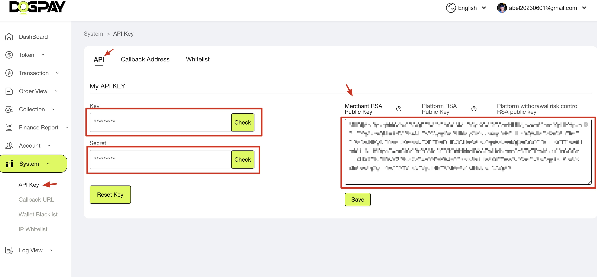
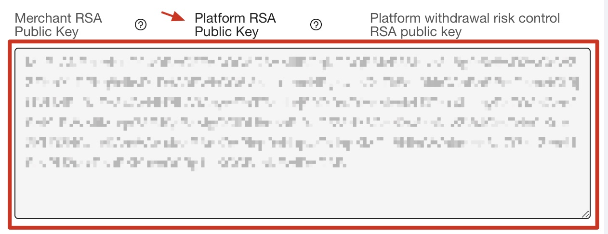
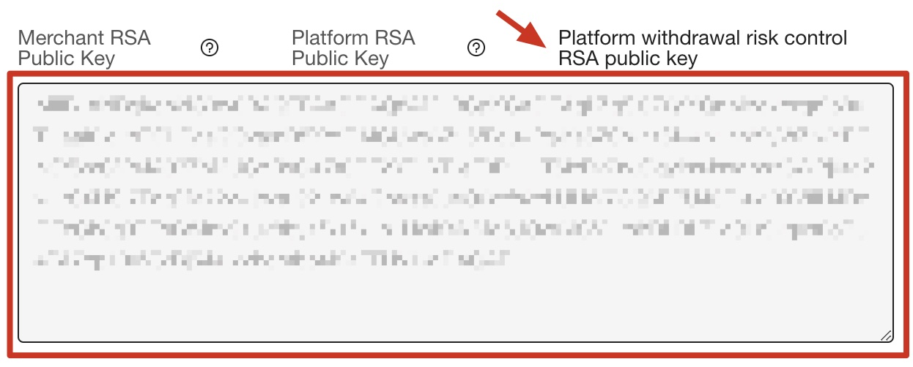
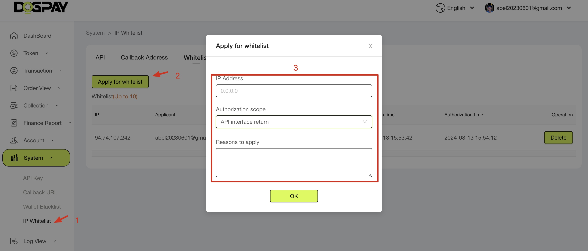
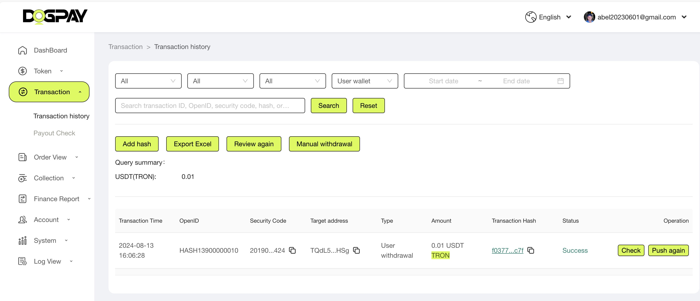
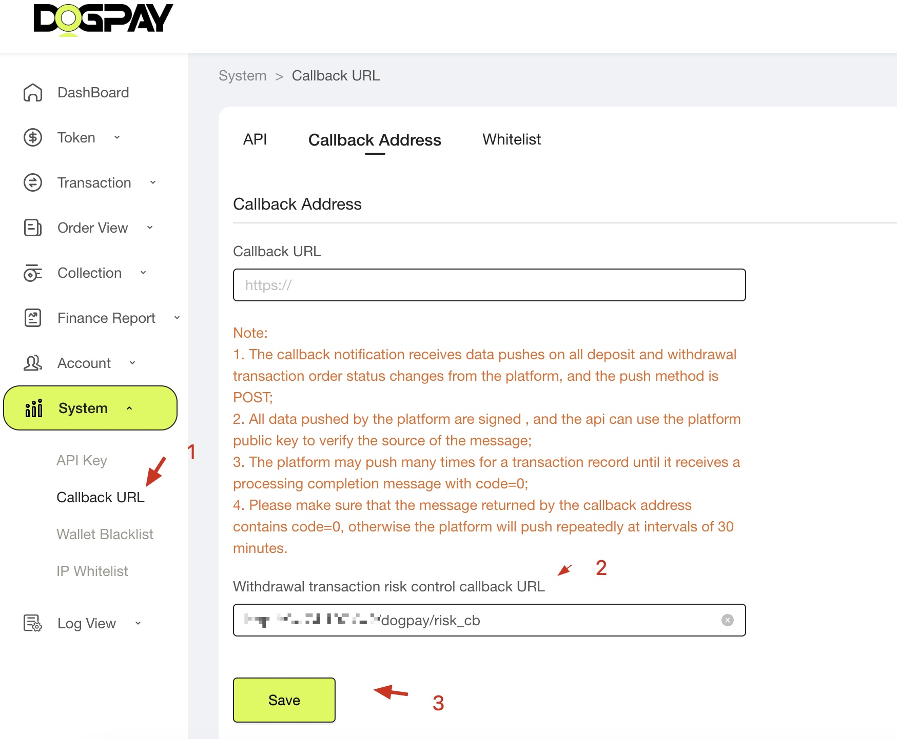

# Chain Pay SDK
<style>
p {
  line-height: 1.8; 
  margin-bottom: 20px; 
}
</style>


English | [简体中文](readme-cn.md)

[](https://opensource.org/licenses/MIT)

## 1. Welcome to use chain pay sdk

### 1.1. Prepare

The unique identifier verifies the partner's identity. Different partners configure different parameters. New partners can contact the platform.

Production environment management platform:

[https://admin.dogpay.ai/#/login](https://admin.dogpay.ai/#/login)

Sandbox environment management platform:

[https://sandbox-admin.privatex.io/](https://sandbox-admin.privatex.io/)

#### Get API key:



(Figure 1-1-1)

1. Create a private key and commit.

```bash
openssl genrsa -out rsa_private_key.pem 2048
```

2. Create a public key from a private key

```bash
openssl rsa -in rsa_private_key.pem -out rsa_public_key.pem -pubout
```

Remove the comments at the head and tail of the generated public key, turn it into a line of string, and submit it to the platform.

Interface sandbox environment docking, joint debugging, and drills. The interface uses `RSA2048` bit two-way signature verification to ensure communication credibility. Merchants need to give the `public key` to the platform in advance for the platform to verify the merchant's request parameters. Merchants need to obtain the `platform public key` in advance for the platform's response result verification.

#### Platform RSA Public Key:



(Figure 1-1-2)

#### Platform withdrawal risk control RSA public key:



(Figure 1-1-3)

#### Callback website need to enable IP whitelist:



(Figure 1-1-4)

#### View transaction list:

(Figure 1-1-5)



#### Set callback website:



(Figure 1-1-6)

## 2. User Management

### 2.1. Create user

* Function: Create a new platform user, which requires passing the user's unique ID

#### HTTP Request

Production Environment API address: [https://vapi.dogpay.ai/sdk/](https://vapi.dogpay.ai/sdk/)

Sandbox environment API address: [https://sandbox-api.privatex.io/sdk/](https://sandbox-api.privatex.io/sdk/)

> POST ： `/user/create`

#### Request Parameters

| Paramter | Required | Type   | Description                                                                                                                       |
| :------- | :------- | :----- | :-------------------------------------------------------------------------------------------------------------------------------- |
| OpenId   | Y        | string | It is recommended to use a platform-wide prefix (such as HASH for partners) + user-unique number to form the user's unique OpenId |

Example

```bash
curl --location 'https://sandbox-api.privatex.io/sdk/user/create' \
--header 'key: vratson2i5hjxgkd' \
--header 'sign: 0592dc64d480fb119d1e07ce06011db8' \
--header 'Content-Type: application/json' \
--header 'timestamp: 1725076567682' \
--data '{
  "OpenId":"PT00001"
}'
```

请求头中的字段说明：

key： 合作伙伴的Key，请参考(图 1-1-1)

sign： The generation rules are`md5( Secret + "Send data key=value, use & to connect in the middle" + Convert the current timestamp milliseconds into a string )`

例子： md5("mysecret"+"OpenId=PT00001"+"1725076567682")

timestamp： Convert the current timestamp milliseconds into a string

#### Return parameter description

| Paramter    | Type   | Description                      |
| :---------- | :----- | :------------------------------- |
| code        | int    | Global status code               |
| msg         | string | Status description               |
| data.OpenId | string | Returns the user's unique OpenId |
| sign        | string | Platform signature               |

返回数据实例：

```json
{
    "sign": "HCL5RTmVsBJBQd8caxUjlATQJbnL/P4rtCdqta2g3ISFR/G4J/MRT3755UmmEbn08s4rlcx/j+MBjo6EesQL9akLG0rAeVfJNpg3InFb1UJOYgEZ+cTYpfnCIIOhOohaCQO9NTABRp89kt+Qnsfq4WuoobOsvLzwSOHq7vQvODrihiRItF+EhIM+TFRbONOyv9nk4Ft85BFF9wwANa0g8m2rAdL8msIpS/ywnvyEx3VSJpASlQo23hhQhxYvnTaHeHzL7cHAz8Zasmm7MTR6Ww+boRwO8X2hLPukaejM46Fx6+uXLWWeN8tQrwiwnLY5XHyjiG0QWFAzhNoasRkjlg==",
    "timestamp": "1725431229743",
    "data": {
        "OpenId": "PT00001"
    },
    "msg": "ok",
    "code": 1
}
```

### 2.2. Create wallet

* Function: Create a wallet account for the user corresponding to this blockchain network
* Precondition: The user with the specified OpenId has been created successfully

#### HTTP Request

Production Environment API address: [https://vapi.dogpay.ai/sdk/](https://vapi.dogpay.ai/sdk/)

Sandbox environment API address: [https://sandbox-api.privatex.io/sdk/](https://sandbox-api.privatex.io/sdk/)

> POST ： `/wallet/create`

#### Request Parameters

| Paramter | Required | Type   | Description          |
| :------- | :------- | :----- | :------------------- |
| ChainID  | Y        | string | Public chain ID      |
| OpenId   | Y        | string | User's unique OpenId |

key： parnter Key

sign： The generation rules are`md5( Secret + "Send data key=value, use & to connect in the middle" + The current timestamp in milliseconds is converted into a string )`

example： md5("mysecret"+"ChainId=1&OpenId=PT00001"+"1725076567682")

timestamp： The current timestamp in milliseconds is converted into a string
chain ID

| Token         | Full name           | Blockchain browser address      | Chain ID unique identifier |
| :------------ | :------------------ | :------------------------------ | :------------------------- |
| eth           | eth                 | https://etherscan.io            | 1                          |
| trx           | Tron                | https://tronscan.io             | 2                          |
| btc           | btc                 | https://blockchair.com/bitcoin  | 3                          |
| sol           | solana              | https://explorer.solana.com     | 4                          |
| xrp           | xrp                 | https://xrpscan.com             | 5                          |
| eth_optimism  | optimism            | https://optimistic.etherscan.io | 10                         |
| bnb           | bnb                 | https://bscscan.com             | 56                         |
| matic_polygon | MATIC polygon chain | https://polygonscan.com         | 137                        |
| TON           | Toncoin             | https://tonscan.org/            | 15186                      |

Example

```bash
curl --location 'https://sandbox-api.privatex.io/sdk/user/create' \
--header 'key: vratson2i5hjxgkd' \
--header 'sign: 0592dc64d480fb119d1e07ce06011db8' \
--header 'Content-Type: application/json' \
--header 'timestamp: 1725076567682' \
--data '{
  "OpenId":"PT00001",
  "ChainID":"1"
}'
```

#### Return parameter description

| Paramter     | Type   | Description          |
| :----------- | :----- | :------------------- |
| code         | int    | Global status code   |
| msg          | string | Status description   |
| data.address | string | Wallet address       |
| data.UserId  | string | User ID              |
| data.ChainID | string | Public chain ID      |
| data.OpenId  | string | User's unique OpenId |
| sign         | string | Platform signature   |

Example

```json
{
    "sign": "i24t857ix3027CPiuQ+getyC7u3pJHcL/m5NiPUQwmv5XkOEdrDnckoblGXIbdO2hgjpJDg47Lbq/YoKu+NiJHGJTwu10CAYDRzyiimBfLsP9yNdnFxJLTUEfOKPSXupJdceMZL8WXF4XkMpwHCrUqhekyM+aVLDHsfROKf3uP+zdjJ++9Z//3Xukg57OBvspYGPqpgIY5fOmALiXs3DgZTdXRYYN6MBRUR3NEd1lb4dSO1AjAGkahhIjGqwaeqSO6YAcfwoj9Be48QS9CurfVxZ9xM8FvbPzPsa2W8kHG7q+Cji4NTk243LJyrQ9QFRpTDUTo5JNrJ1vne/2js8kg==",
    "timestamp": "1725432397796",
    "data": {
        "address": "TUUYqqUsXA2iwfxhiYNfRTKTW3zXFwK3Xx",
        "UserId": 26178,
        "PartnerId": 87,
        "ChainID": 2,
        "OpenId": "PT00001"
    },
    "msg": "ok",
    "code": 1
}
```

## 3. Withdrawl

### 3.1. Partner User Withdrawal

* Function: Provide an operation interface for partner users to withdraw funds. It is necessary to withdraw funds from the partner's corresponding Token withdrawal fund pool account to the withdrawal wallet address set by the user. For partners, a safe callback address can be set to verify the legality of the withdrawal. If the verification is legal, directly operate the merchant fund pool wallet to complete the withdrawal.
* The withdrawal transaction interface will check whether the default withdrawal hot wallet has sufficient wallet fees and withdrawal assets;
* The withdrawal interface will use the security verification code as the unique parameter requirement for withdrawal transactions by default. It is recommended to use the unique withdrawal order number of the business platform as the security code. Repeated security verification code submission will return an error code;
* All withdrawal transaction requests will match the risk control review rules configured on the channel platform. If the parameter request is legal, the transaction request will be received. Transactions that meet the automatic review rules will be submitted to the network immediately, and the Hash information of the submitted transaction will be returned (return field data); for withdrawal transaction requests that need to be reviewed twice in the channel, (code=2) will be returned. There is no need to submit the withdrawal request again. The administrator needs to complete the second review on the channel platform. After the second review is completed, the transaction order will call back to notify the status change of the withdrawal transaction request.
* Precondition: The fund pool of the corresponding currency has an amount exceeding the withdrawal limit (pay special attention to ETH network Token withdrawal, which requires the fund pool wallet to have a certain ETH handling fee balance)
* ⚠️ Note: **For the withdrawal operation of initiating a blockchain, it is necessary to ensure that the pre-review process is completed before calling the interface. Once a blockchain transaction is initiated, it cannot be revoked or returned. **

#### HTTP Request

Production Environment API address: [https://vapi.dogpay.ai/sdk/](https://vapi.dogpay.ai/sdk/)

Sandbox environment API address: [https://sandbox-api.privatex.io/sdk/](https://sandbox-api.privatex.io/sdk/)

> POST ： `/partner/UserWithdrawByOpenID`

#### Request Parameters

| Paramter      | Required | Type   | Description                                                                                                                                                                                                                                                                                                                                                                                                                                                                                                  |
| :------------ | :------- | :----- | :----------------------------------------------------------------------------------------------------------------------------------------------------------------------------------------------------------------------------------------------------------------------------------------------------------------------------------------------------------------------------------------------------------------------------------------------------------------------------------------------------------- |
| OpenId        | Y        | string | User's unique OpenId                                                                                                                                                                                                                                                                                                                                                                                                                                                                                         |
| TokenId       | Y        | string | TokenId                                                                                                                                                                                                                                                                                                                                                                                                                                                                                                      |
| Amount        | Y        | float  | The amount of currency the user withdraws, accurate to 2 decimal places                                                                                                                                                                                                                                                                                                                                                                                                                                      |
| AddressTo     | Y        | string | Destination wallet for withdrawal                                                                                                                                                                                                                                                                                                                                                                                                                                                                            |
| CallBackUrl   | N        | string | Callback to notify the user of the withdrawal progress, optional, using the partner's default callback url                                                                                                                                                                                                                                                                                                                                                                                                   |
| SafeCheckCode | N        | string | The security verification code for user withdrawal transactions is generally the unique withdrawal order number of the business platform. The order number is required to be globally unique. Users request withdrawals multiple times and require different order number parameters. The withdrawal transaction callback information will return the information in this field through the field 'safecode'. The business platform can uniquely associate the withdrawal request based on the order number. |

key： Partner Key

sign： The generation rules are`md5( Secret + "Send data key=value, use & to connect in the middle" + "Convert the current timestamp milliseconds into a string" )`

example： md5("mysecret"+"AddressTo=TQdL5yttJPTx7hJmBhGfo2LcE7AXLPtHSg&Amount=0.02&CallBackUrl=..."+"1725076567682")

timestamp： Convert the current timestamp milliseconds into a string
Token

| TokenID | Value         | Description                         |
| :------ | :------------ | :---------------------------------- |
| 1       | ETH-ETH       | ETH Network ETH                     |
| 2       | ETH-USDT      | ETH Network USDT                    |
| 3       | TRON-TRX      | TRON Network TRX                    |
| 4       | TRON-USDT     | TRON Network token：USDT            |
| 5       | BNB-BNB       | BNB Smart Chain Network BNB         |
| 6       | BNB-USDT      | BNB Smart Chain Network token：USDT |
| 11      | Polygon-MATIC | Polygon Network Matic               |
| 12      | Polygon-USDT  | Polygon Network token：USDT         |
| 13      | Polygon-USDC  | Polygon Network token：USDC         |
| 22      | BNB-USDC      | BNB Smart Chain Network token：USDC |
| 23      | BNB-DAI       | BNB Smart Chain Network token：DAI  |
| 24      | ETH-USDC      | ETH Network USDC                    |
| 25      | ETH-DAI       | ETH Network DAI                     |
| 130     | Optimism-ETH  | Optimism Network ETH                |
| 131     | Optimism-WLD  | Optimism Network token：WLD         |
| 132     | Optimism-USDT | Optimism Network token：USDT        |
| 100     | BTC-BTC       | BTC Network BTC Main chain currency |
| 200     | TON-TON       | TON Network TON Main chain currency |

Example

```bash
curl --location 'https://sandbox-api.privatex.io/sdk/partner/UserWithdrawByOpenID' \
--header 'key: vratson2i5hjxgkd' \
--header 'sign: 0592dc64d480fb119d1e07ce06011db8' \
--header 'Content-Type: application/json' \
--header 'timestamp: 1725076567682' \
--data '{
  "OpenId": "PT00001",
  "TokenId": "4",
  "Amount": "0.02",
  "AddressTo": "TQdL5yttJPTx7hJmBhGfo2LcE7AXLPtHSg",
  "CallBackUrl": "http://xxxxxx/withdraw_callback",
  "SafeCheckCode": "1000000000000000"
}'
```

#### Return parameter description

| Paramter | Type   | Description                                                                                                                                                                                                                                                                                                                                                                                                                                                                                                                                                                                                                                                                                                        |
| :------- | :----- | :----------------------------------------------------------------------------------------------------------------------------------------------------------------------------------------------------------------------------------------------------------------------------------------------------------------------------------------------------------------------------------------------------------------------------------------------------------------------------------------------------------------------------------------------------------------------------------------------------------------------------------------------------------------------------------------------------------------- |
| code     | int    | Status code</br>0 Parameter error, or duplicate order number, or incorrect withdrawal address format, or insufficient handling fee in the withdrawal wallet. msg can be used to view detailed information;</br>1 The withdrawal transaction is successfully submitted and has been submitted to the blockchain network. The data contains the unique hash of the submitted transaction;</br>2 The withdrawal transaction is successfully submitted. The transaction can only be completed after the channel has reviewed it twice. After the review is completed, the transaction information will be updated through callback;</br>-1 The withdrawal transaction failed. You can resubmit the withdrawal request; |
| msg      | string | Status description                                                                                                                                                                                                                                                                                                                                                                                                                                                                                                                                                                                                                                                                                                 |
| data     | string | Transaction hash                                                                                                                                                                                                                                                                                                                                                                                                                                                                                                                                                                                                                                                                                                   |
| sign     | string | Platform signature                                                                                                                                                                                                                                                                                                                                                                                                                                                                                                                                                                                                                                                                                                 |

Example:

```bash
curl --location 'https://sandbox-api.privatex.io/sdk/partner/UserWithdrawByOpenID' \
--header 'key: vratson2i5hjxgkd' \
--header 'sign: 0592dc64d480fb119d1e07ce06011db8' \
--header 'Content-Type: application/json' \
--header 'timestamp: 1725076567682' \
--data '{
  "OpenId":"PT00001",
  "AddressTo":"TPoNrj1a9LCPYHUN88LnGQxG11XoFUNcw3",
  "SafeCheckCode":"1000000000000000",
  "TokenId":"4",
  "Amount":"0.0105"
}'
```

### 3.2. Query user deposit and withdrawal records

* Function: Provide partners with a data interface to query user recharge/withdrawal records, supporting paging query data
* Prerequisites: None

#### HTTP Request

Production Environment API address: [https://vapi.dogpay.ai/sdk/](https://vapi.dogpay.ai/sdk/)

Sandbox environment API address: [https://sandbox-api.privatex.io/sdk/](https://sandbox-api.privatex.io/sdk/)

> POST ： `/wallet/GetPayChargeRecords`

#### Request Parameters

| Paramter | Required | Type   | Description                                                                                                                                           |
| :------- | :------- | :----- | :---------------------------------------------------------------------------------------------------------------------------------------------------- |
| OpenId   | Y        | string | OpenId                                                                                                                                                |
| TopStart | Y        | int    | The starting serial number of the current record, the number of client-defined pages and the calculation of the starting and ending serial numbers    |
| TopEnd   | Y        | int    | The ending serial number of the current record                                                                                                        |
| PayType  | Y        | int    | Filter type, 0 means no filtering, 1 means only querying withdrawal records; 2 means only querying recharge records                                   |
| hashCode | N        | string | Can be empty, specify Hash to query transaction records                                                                                               |
| safeCode | N        | string | Can be empty, specify safeCode, generally withdrawals can query the withdrawal record status through the unique withdrawal security verification code |

#### Return parameter description

| Paramter                                | Type     | Description                                                                                                                                                                                                                                                                                                                      |
| :-------------------------------------- | :------- | :------------------------------------------------------------------------------------------------------------------------------------------------------------------------------------------------------------------------------------------------------------------------------------------------------------------------------- |
| code                                    | int      | status                                                                                                                                                                                                                                                                                                                           |
| msg                                     | string   | status description                                                                                                                                                                                                                                                                                                               |
| data.userPayChargeRecords[]             | object[] | Deposit and withdrawal transaction data collection                                                                                                                                                                                                                                                                               |
| data.userPayChargeRecords.OpenID        | string   | OpenId                                                                                                                                                                                                                                                                                                                           |
| data.userPayChargeRecords.PayOrCharge   | int      | 1 recharge, 2  withdrawal                                                                                                                                                                                                                                                                                                        |
| data.userPayChargeRecords.FromAddress   | string   | from address                                                                                                                                                                                                                                                                                                                     |
| data.userPayChargeRecords.ToAddress     | string   | to address                                                                                                                                                                                                                                                                                                                       |
| data.userPayChargeRecords.HashCode      | string   | Blockchain transactions Hash                                                                                                                                                                                                                                                                                                     |
| data.userPayChargeRecords.SafeCode      | string   | safeCode                                                                                                                                                                                                                                                                                                                         |
| data.userPayChargeRecords.Amount        | float    | Amount: accurate to 2 decimal places                                                                                                                                                                                                                                                                                             |
| data.userPayChargeRecords.Status        | int      | Transaction status,</br> 1 successfully completed,</br>  2 waiting for review,</br>  3 waiting for block transaction confirmation</br>  -1 means transaction failed (business platform needs to roll back user assets)</br>  -2 means review rejected or transaction canceled (business platform needs to roll back user assets) |
| data.userPayChargeRecords.NoticeTimes   | int      | Block confirmation times                                                                                                                                                                                                                                                                                                         |
| data.userPayChargeRecords.NoticeUrl     | string   | Callback address                                                                                                                                                                                                                                                                                                                 |
| data.userPayChargeRecords.NoticeRespone | string   | Callback feedback                                                                                                                                                                                                                                                                                                                |
| data.userPayChargeRecords.CreateTime    | string   | Creation time                                                                                                                                                                                                                                                                                                                    |
| data.TotalCount                         | int      | Total number of transactions, providing paging query data                                                                                                                                                                                                                                                                        |
| sign                                    | string   | Platform Signature                                                                                                                                                                                                                                                                                                               |

### 3.3. Second review of withdrawal order

* Function: Merchant withdrawal order risk control secondary review interface.
* ⚠️ Note: **The platform assigns a separate risk control public key to merchants (different from the deposit/withdrawal public key)**

#### HTTP Request

Production Environment API address: [https://vapi.dogpay.ai/sdk/](https://vapi.dogpay.ai/sdk/)

Sandbox environment API address: [https://sandbox-api.privatex.io/sdk/](https://sandbox-api.privatex.io/sdk/)

> POST ： `/withdrawal/order/check`

#### Request Parameters


| Paramter         | Required | Type          | Description                                                                  |
| :--------------- | :------- | :------------ | :--------------------------------------------------------------------------- |
| data             | N        | object        | As follows                                                                   |
| data.order_id    | Y        | string        | Merchant-side transaction unique ID (trade_id when withdrawing)              |
| data.user_id     | Y        | string        | User to whom the order belongs                                               |
| data.coin_symbol | Y        | string        | Currency name in lowercase, subject to the currency provided by the platform |
| data.address     | Y        | string        | Withdrawal address                                                           |
| data.amount      | Y        | decimal(20,8) | Withdrawal amount                                                            |
| data.timestamp   | Y        | int           | Current timestamp                                                            |

#### Return parameter description

| Paramter         | Type   | Description        |
| :--------------- | :----- | :----------------- |
| status           | int    | 200 means success  |
| msg              | string | Status description |
| data             | object | Data object        |
| data.status_code | int    | 200 means success  |
| data.timestamp   | int    | Timestamp          |
| data.order_id    | int    | Transaction number |
| sign             | string | Platform signature |

### Token transfer callback notification

1. Deposit and withdrawal transactions will be notified repeatedly, and the transaction information and status of the last callback notification will prevail;
2. The business end is required to return valid callback information. The format refers to the return parameter description. The business end needs to return code=0 to indicate that the callback message has been processed and no further notification is required. Otherwise, the callback will continue to notify (initial 50 times every 2 seconds, and then every 10 minutes) until the message confirmation with code=0 is returned;

Set the callback URL through the management backend, refer to the figure (Figure 1-1-6).

> POST 

* Function: Define the format of the callback message that the platform sends to the application for receiving Token transfer notifications, which is suitable for the application to handle event notification messages for Token transaction status (withdrawal or recharge). The application can design optional callback notification interface functions based on the application functions.

#### Request Parameters

| Paramter     | Required | Type   | Description                                                                                                                                                                                                                                                                                                                                                                                                                                                                                                                                                                                                                                                                                                                                                                                                                                                                                                                                                                                                                                                                                                                                                                                                                                                                                                                                                          |
| :----------- | :------- | :----- | :------------------------------------------------------------------------------------------------------------------------------------------------------------------------------------------------------------------------------------------------------------------------------------------------------------------------------------------------------------------------------------------------------------------------------------------------------------------------------------------------------------------------------------------------------------------------------------------------------------------------------------------------------------------------------------------------------------------------------------------------------------------------------------------------------------------------------------------------------------------------------------------------------------------------------------------------------------------------------------------------------------------------------------------------------------------------------------------------------------------------------------------------------------------------------------------------------------------------------------------------------------------------------------------------------------------------------------------------------------------- |
| status       | Y        | int    | Transaction status:</br>1 The transaction is completed and has been successfully submitted to the blockchain network. The transaction details on the chain can be queried through Hash;</br>-1 The transaction has been submitted to the blockchain network. The transaction on the chain failed. You can go to Merchant Management-->Transaction Management-->Re-examine [Submit Order Security Code]. The business platform does not need to process the status change and just wait for the channel to callback the new status notification;</br>-2 The withdrawal transaction application was rejected by the merchant backend and the withdrawal application has expired. It is recommended that the business platform return the user's withdrawal application after receiving the notification;</br>2 The withdrawal transaction has been submitted to the merchant management. Since the configured currency security risk control requirements have been triggered, the administrator needs to further log in to the merchant management-->Transaction Management-->Withdrawal Review to complete the withdrawal application processing;</br>3 The withdrawal transaction blockchain transaction is being processed. The business platform does not need to update the status change and just wait for the channel to callback the new status notification; |
| type         | Y        | int    | 1 indicates a deposit transaction; 2 indicates a withdrawal transaction                                                                                                                                                                                                                                                                                                                                                                                                                                                                                                                                                                                                                                                                                                                                                                                                                                                                                                                                                                                                                                                                                                                                                                                                                                                                                              |
| hash         | Y        | string | Hash                                                                                                                                                                                                                                                                                                                                                                                                                                                                                                                                                                                                                                                                                                                                                                                                                                                                                                                                                                                                                                                                                                                                                                                                                                                                                                                                                                 |
| confirm      | Y        | int    | The number of confirmations of the transaction completed on the chain                                                                                                                                                                                                                                                                                                                                                                                                                                                                                                                                                                                                                                                                                                                                                                                                                                                                                                                                                                                                                                                                                                                                                                                                                                                                                                |
| createdtime  | Y        | string | create time                                                                                                                                                                                                                                                                                                                                                                                                                                                                                                                                                                                                                                                                                                                                                                                                                                                                                                                                                                                                                                                                                                                                                                                                                                                                                                                                                          |
| from         | Y        | string | Transaction from address                                                                                                                                                                                                                                                                                                                                                                                                                                                                                                                                                                                                                                                                                                                                                                                                                                                                                                                                                                                                                                                                                                                                                                                                                                                                                                                                             |
| to           | Y        | string | Transaction to address                                                                                                                                                                                                                                                                                                                                                                                                                                                                                                                                                                                                                                                                                                                                                                                                                                                                                                                                                                                                                                                                                                                                                                                                                                                                                                                                               |
| amount       | Y        | string | Number of transactions                                                                                                                                                                                                                                                                                                                                                                                                                                                                                                                                                                                                                                                                                                                                                                                                                                                                                                                                                                                                                                                                                                                                                                                                                                                                                                                                               |
| chainid      | Y        | string | chain Id id                                                                                                                                                                                                                                                                                                                                                                                                                                                                                                                                                                                                                                                                                                                                                                                                                                                                                                                                                                                                                                                                                                                                                                                                                                                                                                                                                          |
| tokenid      | Y        | string | tokenid                                                                                                                                                                                                                                                                                                                                                                                                                                                                                                                                                                                                                                                                                                                                                                                                                                                                                                                                                                                                                                                                                                                                                                                                                                                                                                                                                              |
| tokenaddress | Y        | string | token contract address                                                                                                                                                                                                                                                                                                                                                                                                                                                                                                                                                                                                                                                                                                                                                                                                                                                                                                                                                                                                                                                                                                                                                                                                                                                                                                                                               |
| safecode     | Y        | string | Valid for withdrawal orders, usually the unique number of the withdrawal order orderid                                                                                                                                                                                                                                                                                                                                                                                                                                                                                                                                                                                                                                                                                                                                                                                                                                                                                                                                                                                                                                                                                                                                                                                                                                                                               |
| timestamp    | Y        | string | Transaction timestamp                                                                                                                                                                                                                                                                                                                                                                                                                                                                                                                                                                                                                                                                                                                                                                                                                                                                                                                                                                                                                                                                                                                                                                                                                                                                                                                                                |
| tag          | N        | string | optional just for XRP，EOS                                                                                                                                                                                                                                                                                                                                                                                                                                                                                                                                                                                                                                                                                                                                                                                                                                                                                                                                                                                                                                                                                                                                                                                                                                                                                                                                           |
| sign         | Y        | string | Platform signature data **The recipient can use the platform public key to verify the reliability of the data returned by the platform. It is strongly recommended that the recipient verify the validity of the signature**                                                                                                                                                                                                                                                                                                                                                                                                                                                                                                                                                                                                                                                                                                                                                                                                                                                                                                                                                                                                                                                                                                                                         |


Example

```json
{
    "amount": "0.010000",
    "chainid": "2",
    "confirm": "1",
    "createdtime": "1725439986000",
    "from": "TEuTmxuzNKA5HNAuPTmNBvpJgmci4HUKi2",
    "hash": "94f4c29eba73d53dcd3aa8b97a4032dcdf7ff172e7",
    "safecode": "safecode00001",
    "sign": "Cd29MM1IxnhHh/cNB5DACUCtm31+R5vMx51OpGvLXRmtqvEhdZ9/WHaXZCtHcD0+71eQRgAoXaUDNHyFefqHdmQTfM+VLeHHIgL6c/WiOeZNeANC+T32hpg8gph1DIfY9/hHAHXmB/85swaZTu4lnHptdVu7LWiEkGPPdBPkNn8xyW3DRlildWxGauOxp001f9nH64YhIuUXiA4Fv8a9okhSq9xmrFKQ5FMaobTAWJyE+6hEwG5Bwraapz5C2Bs32jNlC7ifwgC+NaFoPInZxt2tNfdY/OFJnoQk2+Jp1Q==",
    "status": "1",
    "timestamp": "1725439996013",
    "to": "TQdL5yttJPTx7hJmBhGfo2LcE7AXLPtHSg",
    "tokenaddress": "TR7NHqjeKQxGTCi8q8",
    "tokenid": "4",
    "type": "2"
}
```

### 4.1. Second review of withdrawal order

* Function: Merchant withdrawal order risk control secondary review interface
* ⚠️ Note: **The platform assigns a separate risk control RSA public key to the merchant (different from the recharge/withdrawal callback notification public key)**
* Triggering time: After the administrator configures the risk control callback URL parameter on the merchant side (system settings), the channel will add an additional risk control callback secondary review to each withdrawal transaction interface request initiated. Only when the merchant-side risk control URL returns the correct verification pass code can the transaction be effectively submitted.

#### HTTP Request

> POST ： `/withdrawal/order/check`

#### Request Parameters

| Paramter  | Required | Type   | Description                                                                                                                                                  |
| :-------- | :------- | :----- | :----------------------------------------------------------------------------------------------------------------------------------------------------------- |
| safeCode  | N        | string | The merchant submits a unique transaction ID, which generally corresponds to the merchant withdrawal order ID (SafeCheckCode of the withdrawal transaction） |
| openId    | Y        | string | User ID of the merchant submitting the withdrawal transaction                                                                                                |
| tokenId   | Y        | string | Currency ID, subject to the currency ID provided by the platform                                                                                             |
| toAddress | Y        | string | Withdrawal address                                                                                                                                           |
| amount    | Y        | string | Withdrawal amount                                                                                                                                            |
| timestamp | Y        | int    | Current timestamp                                                                                                                                            |
| sign      | Y        | string | Signature, only the parameters in data are signed; the platform's risk control RSA public key is required to verify the correctness of the signature         |

#### Return parameter description

| Paramter  | Type   | Description                                                                                    |
| :-------- | :----- | :--------------------------------------------------------------------------------------------- |
| code      | int    | Verify the inspection result, 0 means the inspection passed; other codes are invalid           |
| timestamp | int    | Current timestamp, in seconds                                                                  |
| message   | string | Return message                                                                                 |
| sign      | string | Signature - Sign the data field in the response parameter using the merchant's RSA private key |


### 5.2. Public Information

The following information is common to all interfaces and will not be repeated for each interface.

#### 5.2.1. Production Environment 

API address: [https://vapi.dogpay.ai/sdk/](https://vapi.dogpay.ai/sdk/)

#### 5.2.2. Sandbox environment 

API address: [https://sandbox-api.privatex.io/sdk/](https://sandbox-api.privatex.io/sdk/)

#### 5.2.3. Request public parameters

Request header definition

| Parameter Name | Constraint | Example                          | Description                                |
| :------------- | :--------- | :------------------------------- | :----------------------------------------- |
| key            | length:64  | ithujj3onrzbgw5t                 | Partner key                                |
| timestamp      | length:32  | 1722586649000                    | Timestamp of the request (in milliseconds) |
| sign           | length:32  | 9e0ccfe3915e94bcc5bf7dd51ad4e8d9 | Partner secret signature                   |
| clientSign     | length:512 | 4bcc5bf7dd51ad4e8d9  ...         | Partner RSA signature                      |
* `sign` field rules

1. Register partners, get Key and Secret

2. Parse the JSON Body of the request, sort the keys in JSON from small to large according to ASCII, and concatenate the string dataStr=key1=value1&key2=value2&key3=value3&...

3. Generate timestamp (unit: milliseconds)

4. Encrypt to generate sign:

Plain text before encryption: strToHash = Secret+dataStr+timestamp

Perform MD5 encryption on the above plain text strToHash to generate sign

5. Put key, timestamp, sign in http head

clientSign

Detailed explanation of signature algorithm

1. Get request parameters and format them to obtain a new parameter formatted string:

2. Sign the first step data with RSA private key and save the signature result to a variable:

Generate signature string, for the following parameter array: `user_id = 1 coin = eth address = 0x038B8E7406dED2Be112B6c7E4681Df5316957cad amount = 10.001 trade_id = 20220131012030274786`

Sort each key in the array from a to z. If you encounter the same first letter, look at the second letter, and so on. After the sorting is completed, connect all array values ​​with the "&" character, such as $dataString:

`address=0x038B8E7406dED2Be112B6c7E4681Df5316957cad&amount=10.001&coin=eth&trade_id=20220131012030274786&user_id=1`

This string is the concatenated string.

Use the private key to sign the data with `RSA-md5`.

#### 1.3.4. Public Information Notice

| Name               | Type      | Example                            | Description                                                 |
| :----------------- | :-------- | :--------------------------------- | :---------------------------------------------------------- |
| Global status code | integer   | 1                                  | 1 means success, see Global Status Code for details         |
| Information        | string    | ok                                 | Returns information in text format                          |
| Data               | json      | {"OpenID":"HEX..."}                | Returns specific data content                               |
| Time               | timeStamp | 1722587274000                      | UTC time is unified time without time zone, in milliseconds |
| Signature          | sign      | 9e0ccfe3915e94bcc5bfbBsC5EUxV6 ... | The platform uses RSA to sign all data                      |

## 6. Install

```bash
go get github.com/goodwood511/chain_play_sdk
```

Note: You need to run Go 1.18+ to compile;

## 7. Business flow

### 7.1. Recharge flow


### 7.2. withdraw flow


## 8. SDK

### 8.1. Configuration required

1. Register a business name to obtain `ApiKey` and `ApiSecret`;
2. Generate your own `RSA` password pair;
3. Prepare the platform's `RSA` public key;

### 8.2. Creating a Signature Object

1. Add a configuration file `config.yaml`.

```yaml
ApiKey: ""
ApiSecret: ""
PlatformPubKey: ""
RsaPrivateKey: ""
```

2. Load the configuration file and create the API object.

```golang

	viper.SetConfigFile("config.yaml")
	viper.AddConfigPath(".")
	if err := viper.ReadInConfig(); err != nil {
		panic(fmt.Sprintf("Failed to load config: %s", err))
	}
	apiObj := api.NewSDK(api.SDKConfig{
		ApiKey:             viper.GetString("ApiKey"),
		ApiSecret:          viper.GetString("ApiSecret"),
		PlatformPubKey:     viper.GetString("PlatformPubKey"),
		PlatformRiskPubKey: viper.GetString("PlatformRiskPubKey"),
		RsaPrivateKey:      viper.GetString("RsaPrivateKey"),
	})

```

### 8.3. Create request data and sign it

Let's take creating a user as an example.

```golang

  // ....
	openId := "PT00001"

	reqBody, timestamp, sign, clientSign, err := apiObj.CreateUser(openId)
	if err != nil {
		logrus.Warnln("Error: ", err)
		return
	}

```

### 8.4. Fill Request Initiate Request

```golang
  // ....
	
	finalURL, err := url.JoinPath(api.DevNetEndpoint, api.PathCreateWallet)
	if err != nil {
		logrus.Warnln("Error: ", err)
		return
	}

	resp, err := client.R().
		SetHeader("Content-Type", "application/json").
		SetBody(reqBody).
		SetHeader("key", apiObj.GetApiKey()).
		SetHeader("timestamp", timestamp).
		SetHeader("sign", sign).
		SetHeader("clientSign", clientSign).
		Post(finalURL)

```

### 8.5. Verify parsing return data

```golang

	rspCommon := response_define.ResponseCommon{}
	err = json.Unmarshal(body, &rspCommon)
	if err != nil {
		logrus.Warnln("Error: ", err)
		return
	}
	logrus.Infoln("Response: ", rspCommon)

	if rspCommon.Code != response_define.SUCCESS {
		logrus.Warnln("Response fail Code", rspCommon.Code, "Msg", rspCommon.Msg)
		return
	}

	rspCreateUser := response_define.ResponseCreateUser{}
	err = json.Unmarshal(body, &rspCreateUser)
	if err != nil {
		logrus.Warnln("Error: ", err)
		return
	}
	logrus.Infoln("ResponseCreateUser: ", rspCreateUser)

	mapObj := rsa_utils.ToStringMap(body)
	err = apiObj.VerifyRSAsignature(mapObj, rspCreateUser.Sign)
	if err != nil {
		logrus.Warnln("Error: ", err)
		return
	}

```

## 9. Global status code

> 🔔Interface return value status code meaning list

| Status code | Meaning                                         | Remark |
| :---------- | :---------------------------------------------- | :----- |
| 1           | success                                         |        |
| 10701       | Failed to create user: This user already exists |        |

## 10. Token

| TokenID | Value         | Description                         |
| :------ | :------------ | :---------------------------------- |
| 1       | ETH-ETH       | ETH Network ETH                     |
| 2       | ETH-USDT      | ETH Network USDT                    |
| 3       | TRON-TRX      | TRON Network TRX                    |
| 4       | TRON-USDT     | TRON Network token：USDT            |
| 5       | BNB-BNB       | BNB Smart Chain Network BNB         |
| 6       | BNB-USDT      | BNB Smart Chain Network token：USDT |
| 11      | Polygon-MATIC | Polygon Network Matic               |
| 12      | Polygon-USDT  | Polygon Network token：USDT         |
| 13      | Polygon-USDC  | Polygon Network token：USDC         |
| 22      | BNB-USDC      | BNB Smart Chain Network token：USDC |
| 23      | BNB-DAI       | BNB Smart Chain Network token：DAI  |
| 24      | ETH-USDC      | ETH Network USDC                    |
| 25      | ETH-DAI       | ETH Network DAI                     |
| 130     | Optimism-ETH  | Optimism Network ETH                |
| 131     | Optimism-WLD  | Optimism Network token：WLD         |
| 132     | Optimism-USDT | Optimism Network token：USDT        |
| 100     | BTC-BTC       | BTC Network BTC Main chain currency |
| 200     | TON-TON       | TON Network TON Main chain currency |

## 11. chain ID

| Token         | Full name           | Blockchain browser address      | Chain ID unique identifier |
| :------------ | :------------------ | :------------------------------ | :------------------------- |
| eth           | eth                 | https://etherscan.io            | 1                          |
| trx           | Tron                | https://tronscan.io             | 2                          |
| btc           | btc                 | https://blockchair.com/bitcoin  | 3                          |
| sol           | solana              | https://explorer.solana.com     | 4                          |
| xrp           | xrp                 | https://xrpscan.com             | 5                          |
| eth_optimism  | optimism            | https://optimistic.etherscan.io | 10                         |
| bnb           | bnb                 | https://bscscan.com             | 56                         |
| matic_polygon | MATIC polygon chain | https://polygonscan.com         | 137                        |
| TON           | Toncoin             | https://tonscan.org/            | 15186                      |

## 12. token list

| main network    | chain_id | token_id | token_address                                                      | symbol | decimals |
| --------------- | -------- | -------- | ------------------------------------------------------------------ | ------ | -------- |
| Ethereum        | 1        | 2        | 0xdac17f958d2ee523a2206206994597c13d831ec7                         | USDT   | 6        |
|                 | 1        | 140      | 0x6982508145454Ce325dDbE47a25d4ec3d2311933                         | PEPE   | 18       |
|                 | 1        | 141      | 0xb131f4A55907B10d1F0A50d8ab8FA09EC342cd74                         | MEME   | 18       |
|                 | 1        | 64       | 0xEd04915c23f00A313a544955524EB7DBD823143d                         | ACH    | 8        |
|                 | 1        | 25       | 0x6B175474E89094C44Da98b954EedeAC495271d0F                         | DAI    | 18       |
|                 | 1        | 24       | 0xA0b86991c6218b36c1d19D4a2e9Eb0cE3606eB48                         | USDC   | 6        |
|                 | 1        | 142      | 0x163f8C2467924be0ae7B5347228CABF260318753                         | WLD    | 18       |
|                 | 1        | 1        |                                                                    | ETH    | 18       |
| Tron            | 2        | 40       | THb4CqiFdwNHsWsQCs4JhzwjMWys4aqCbF                                 | ETH    | 18       |
|                 | 2        | 90       | TPYmHEhy5n8TCEfYGqW2rPxsghSfzghPDn                                 | USDD   | 18       |
|                 | 2        | 26       | TEkxiTehnzSmSe2XqrBj4w32RUN966rdz8                                 | USDC   | 6        |
|                 | 2        | 33       | TSkW873XMKiDCxGZrA4YH8KGeipLdC6Gyu                                 | CVNT   | 18       |
|                 | 2        | 3        | TRX                                                                | TRX    | 6        |
|                 | 2        | 4        | TR7NHqjeKQxGTCi8q8ZY4pL8otSzgjLj6t                                 | USDT   | 6        |
| Bitcoin         | 3        | 100      | BTC                                                                | BTC    | 8        |
|                 | 3        | 102      | SATS                                                               | SATS   | 18       |
|                 | 3        | 103      | RATS                                                               | RATS   | 18       |
|                 | 3        | 101      | ORDI                                                               | ORDI   | 18       |
| Solana          | 4        | 400      | Es9vMFrzaCERmJfrF4H2FYD4KCoNkY11McCe8BenwNYB                       | USDT   | 6        |
|                 | 4        | 401      | EPjFWdd5AufqSSqeM2qN1xzybapC8G4wEGGkZwyTDt1v                       | USDC   | 6        |
|                 | 4        | 19       | SOL                                                                | SOL    | 9        |
|                 | 4        | 410      | nQ1qgSpXWi71twnWPFjyfCtcbUXbVyQb64RfHKwRpKE                        | DAOT   | 9        |
| XRP             | 5        | 200      | XRP                                                                | XRP    | 6        |
| DogeCoin        | 9        | 300      | DOGE                                                               | DOGE   | 8        |
| Optimistic      | 10       | 131      | 0xdC6fF44d5d932Cbd77B52E5612Ba0529DC6226F1                         | WLD    | 18       |
|                 | 10       | 130      | ETH                                                                | ETH    | 18       |
|                 | 10       | 133      | 0x0b2C639c533813f4Aa9D7837CAf62653d097Ff85                         | USDC   | 6        |
|                 | 10       | 132      | 0x94b008aA00579c1307B0EF2c499aD98a8ce58e58                         | USDT   | 6        |
| Bnb Smart Chain | 56       | 62       | 0xc0be866ecc026957fc7160c1a45f2bee9870fd46                         | ARK    | 18       |
|                 | 56       | 68       | 0x6FDcdfef7c496407cCb0cEC90f9C5Aaa1Cc8D888                         | VET    | 18       |
|                 | 56       | 63       | 0x8540f3D726Aed340Bc57Fd07a61b0ae2a9d5ECa9                         | PUC    | 18       |
|                 | 56       | 65       | 0xbc7d6b50616989655afd682fb42743507003056d                         | ACH    | 8        |
|                 | 56       | 66       | 0xFE8bF5B8F5e4eb5f9BC2be16303f7dAB8CF56aA8                         | BIBI   | 18       |
|                 | 56       | 29       | 0xe9e7CEA3DedcA5984780Bafc599bD69ADd087D56                         | BUSD   | 18       |
|                 | 56       | 31       | 0x7130d2A12B9BCbFAe4f2634d864A1Ee1Ce3Ead9c                         | BTCB   | 18       |
|                 | 56       | 30       | 0x2170Ed0880ac9A755fd29B2688956BD959F933F8                         | ETH    | 18       |
|                 | 56       | 6        | 0x55d398326f99059ff775485246999027b3197955                         | USDT   | 18       |
|                 | 56       | 23       | 0x1AF3F329e8BE154074D8769D1FFa4eE058B1DBc3                         | DAI    | 18       |
|                 | 56       | 22       | 0x8AC76a51cc950d9822D68b83fE1Ad97B32Cd580d                         | USDC   | 18       |
|                 | 56       | 5        | BNB                                                                | BNB    | 18       |
| Polygon         | 137      | 12       | 0xc2132D05D31c914a87C6611C10748AEb04B58e8F                         | USDT   | 6        |
|                 | 137      | 13       | 0x2791Bca1f2de4661ED88A30C99A7a9449Aa84174                         | USDC   | 6        |
|                 | 137      | 11       | MATIC                                                              | MATIC  | 18       |
|                 | 137      | 110      | 0x3c499c542cEF5E3811e1192ce70d8cC03d5c3359                         | USDC   | 6        |
| CVN Chain       | 2032     | 7        | CVN                                                                | CVN    | 18       |
|                 | 2032     | 35       | 0x109B57A29eE6E9A93f33687F6CE553fB18D8EE78                         | USDT   | 6        |
|                 | 2032     | 51       | 0x6b94b0a2878c68811c1bd6cecc2b7cc44a9ed7ab                         | HPT    | 8        |
| Merlin          | 4200     | 500      | BTC                                                                | BTC    | 18       |
|                 | 4200     | 501      | 0x5c46bFF4B38dc1EAE09C5BAc65872a1D8bc87378                         | MERL   | 18       |
| Base            | 8453     | 801      | 0x833589fCD6eDb6E08f4c7C32D4f71b54bdA02913                         | USDC   | 6        |
|                 | 8453     | 802      | ETH                                                                | ETH    | 18       |
| TON             |          | 201      | 0:105e5589bc66db15f13c177a12f2cf3b94881da2f4b8e7922c58569176625eb5 | JETTON | 9        |
|                 | 15186    | 202      | 0:b113a994b5024a16719f69139328eb759596c38a25f59028b146fecdc3621dfe | USDT   | 6        |
|                 | 15186    | 200      | TON                                                                | TON    | 9        |
| Arbitrum One    | 42161    | 122      | 0xaf88d065e77c8cC2239327C5EDb3A432268e5831                         | USDC   | 6        |
|                 | 42161    | 121      | 0xFd086bC7CD5C481DCC9C85ebE478A1C0b69FCbb9                         | USDT   | 6        |
|                 | 42161    | 120      | ETH                                                                | ETH    | 18       |
|                 | 42161    | 123      | 0x9fE175843Df9deCd99C78E72b2424C47D61Ad2bF                         | ATM    | 18       |
|                 | 42161    | 124      | 0x58BDf739aE17d1C60C6FD3433E288E38B81C2853                         | SAM    | 18       |
| Avax Chain C    | 43114    | 18       | 0xB97EF9Ef8734C71904D8002F8b6Bc66Dd9c48a6E                         | USDC   | 6        |
|                 | 43114    | 17       | 0xc7198437980c041c805A1EDcbA50c1Ce5db95118                         | USDT   | 6        |
|                 | 43114    | 16       | AVAX                                                               | AVAX   | 18       |
| NA Chain        | 65143    | 600      | NAC                                                                | NAC    | 9        |
|                 | 65143    | 601      | GAT                                                                | GAT    | 9        |
| ODIN            | 666666   | 80       | ODIN                                                               | ODIN   | 18       |
| THOR            | 868868   | 81       | THOR                                                               | THOR   | 18       |
