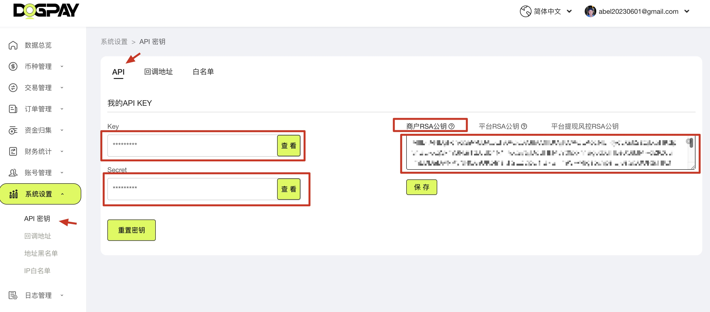
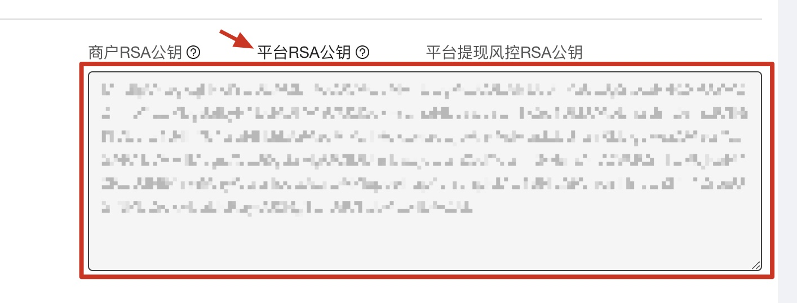
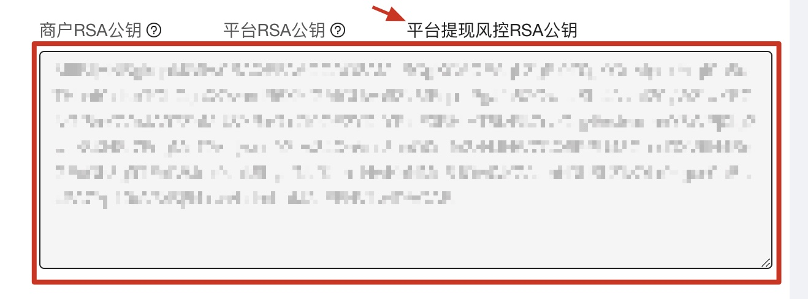
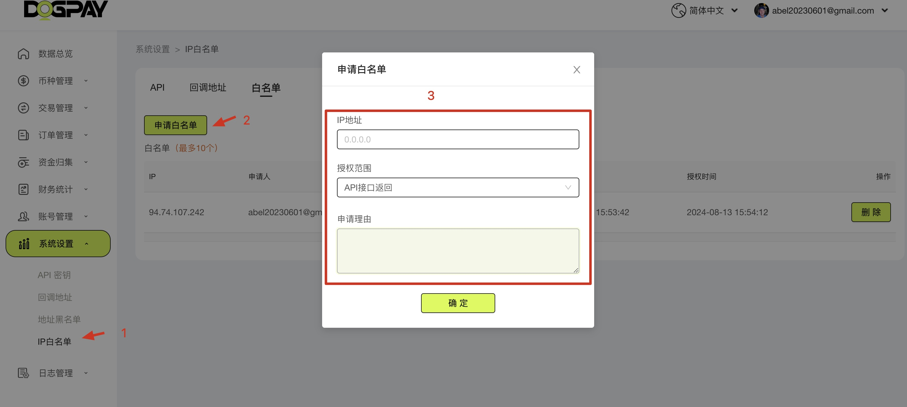
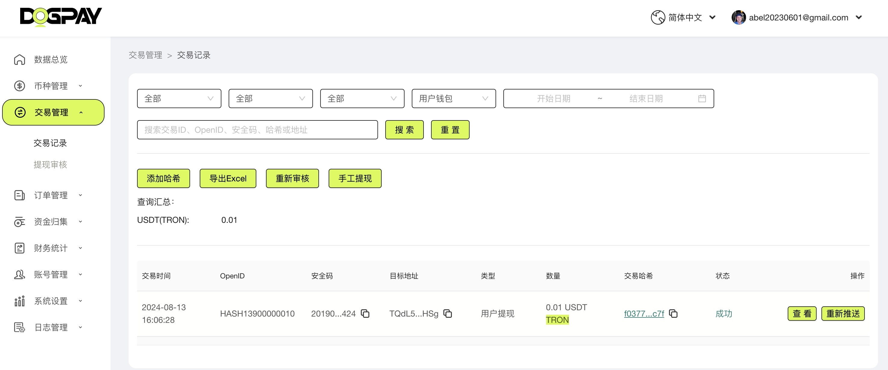
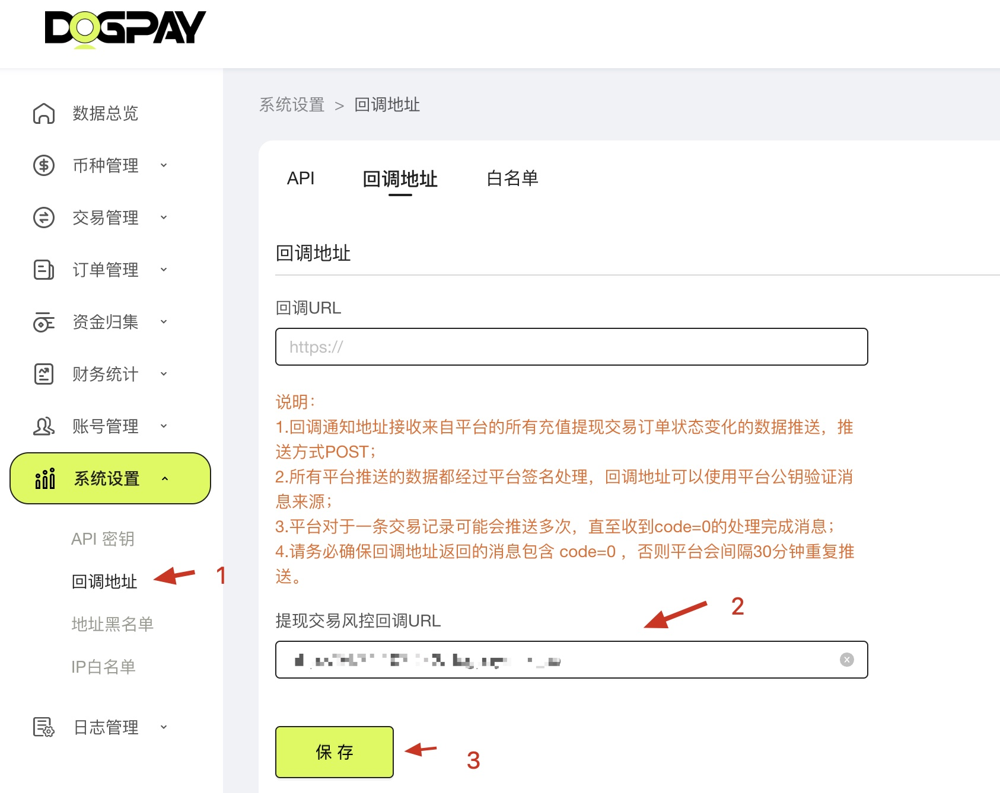

# Chain Pay SDK


[English](README.md) | 简体中文

[](https://opensource.org/licenses/MIT)

## 1. 欢迎使用 chain pay sdk

### 1.1. 准备接入

唯一标识验证合作伙伴身份，不同的合作伙伴配置不同参数，新合作伙伴可以联系平台。

正式环境管理平台：

[https://admin.dogpay.ai/#/login](https://admin.dogpay.ai/#/login)

沙盒环境管理平台：

[https://sandbox-admin.privatex.io/](https://sandbox-admin.privatex.io/)

#### 查看`API`密钥：



(图 1-1-1)

商家的`RSA`公钥生成并且提交

1. 通过命令行创建私钥，妥善保管好私钥。

```bash
openssl genrsa -out rsa_private_key.pem 2048
```

2. 根据私钥创建公钥

```bash
openssl rsa -in rsa_private_key.pem -out rsa_public_key.pem -pubout
```

将生成的公钥去掉头部、尾部的注释，将其变成一行字符串，提交到平台。

接口沙盒环境对接，联调，演练。 接口采用 `RSA2048` 位 双向签名验签形式确保通信可信性。 商户需要提前将`公钥`给到平台，用于平台对商户请求参数验签。 商户需要提前获取`平台公钥`，用于对平台响应结果验签。

#### 查看平台`RSA`公钥：



(图 1-1-2)

#### 查看平台风控`RSA`公钥：



(图 1-1-3)


#### 回调地址需要开通 ip 白名单：



(图 1-1-4)

#### 查看交易列表：



(图 1-1-5)

#### 设置`callback`地址：



(图 1-1-6)

## 2. 用户管理

### 2.1. 注册新用户

* 功能：创建新的平台用户，需要传递用户唯一 ID 标识

#### HTTP Request

生产环境`API`地址：[https://vapi.dogpay.ai/sdk/](https://vapi.dogpay.ai/sdk/)

沙盒环境`API`地址：[https://sandbox-api.privatex.io/sdk/](https://sandbox-api.privatex.io/sdk/)

> POST ： `/user/create`

#### 请求参数

| 参数名 | 必选 | 类型   | 说明                                                                        |
| :----- | :--- | :----- | :-------------------------------------------------------------------------- |
| OpenId | 是   | string | 建议采用平台统一前缀（如合作伙伴：HASH）+用户唯一号码 构成用户的唯一 OpenId |

请求实例：

```bash
curl --location 'https://sandbox-api.privatex.io/sdk/user/create' \
--header 'key: vratson2i5hjxgkd' \
--header 'sign: 0592dc64d480fb119d1e07ce06011db8' \
--header 'Content-Type: application/json' \
--header 'timestamp: 1725076567682' \
--data '{
  "OpenId":"PT00001"
}'
```

请求头中的字段说明：

key： 合作伙伴的Key，请参考(图 1-1-1)

sign： 生成规则为`md5( 合作伙伴的Secret + "发送数据key=value，中间使用&连接" + 当前时间戳毫秒转换成字符串 )`

例子： md5("mysecret"+"OpenId=PT00001"+"1725076567682")

timestamp： 当前时间戳毫秒转换成字符串

#### 返回参数说明

| 参数名      | 类型   | 说明               |
| :---------- | :----- | :----------------- |
| code        | int    | 全局状态码         |
| msg         | string | 状态描述           |
| data.OpenId | string | 返回用户唯一OpenId |
| sign        | string | 平台签名           |

返回数据实例：

```json
{
    "sign": "HCL5RTmVsBJBQd8caxUjlATQJbnL/P4rtCdqta2g3ISFR/G4J/MRT3755UmmEbn08s4rlcx/j+MBjo6EesQL9akLG0rAeVfJNpg3InFb1UJOYgEZ+cTYpfnCIIOhOohaCQO9NTABRp89kt+Qnsfq4WuoobOsvLzwSOHq7vQvODrihiRItF+EhIM+TFRbONOyv9nk4Ft85BFF9wwANa0g8m2rAdL8msIpS/ywnvyEx3VSJpASlQo23hhQhxYvnTaHeHzL7cHAz8Zasmm7MTR6Ww+boRwO8X2hLPukaejM46Fx6+uXLWWeN8tQrwiwnLY5XHyjiG0QWFAzhNoasRkjlg==",
    "timestamp": "1725431229743",
    "data": {
        "OpenId": "PT00001"
    },
    "msg": "ok",
    "code": 1
}
```

### 2.2. 注册钱包

* 功能：创建用户对应这个区块链网络的钱包账号
* 前置条件：指定 OpenId 的用户已经创建成功

#### HTTP Request

生产环境`API`地址：[https://vapi.dogpay.ai/sdk/](https://vapi.dogpay.ai/sdk/)

沙盒环境`API`地址：[https://sandbox-api.privatex.io/sdk/](https://sandbox-api.privatex.io/sdk/)

> POST ： `/wallet/create`

#### 请求参数

| 参数名  | 必选 | 类型   | 说明              |
| :------ | :--- | :----- | :---------------- |
| ChainID | 是   | string | 链ID唯一标识      |
| OpenId  | 是   | string | 用户的唯一 OpenId |

ChainID 清单

| 币名          | 全名称              | 区块链浏览器地址                | 链ID唯一标识 |
| :------------ | :------------------ | :------------------------------ | :----------- |
| eth           | eth                 | https://etherscan.io            | 1            |
| trx           | Tron                | https://tronscan.io             | 2            |
| btc           | btc                 | https://blockchair.com/bitcoin  | 3            |
| sol           | solana              | https://explorer.solana.com     | 4            |
| xrp           | xrp                 | https://xrpscan.com             | 5            |
| eth_optimism  | optimism            | https://optimistic.etherscan.io | 10           |
| bnb           | bnb                 | https://bscscan.com             | 56           |
| matic_polygon | MATIC polygon chain | https://polygonscan.com         | 137          |
| TON           | Toncoin             | https://tonscan.org/            | 15186        |

请求实例：

```bash
curl --location 'https://sandbox-api.privatex.io/sdk/user/create' \
--header 'key: vratson2i5hjxgkd' \
--header 'sign: 0592dc64d480fb119d1e07ce06011db8' \
--header 'Content-Type: application/json' \
--header 'timestamp: 1725076567682' \
--data '{
  "OpenId":"PT00001",
  "ChainID":"1"
}'
```

key： 合作伙伴的Key

sign： 生成规则为`md5( 合作伙伴的Secret + "发送数据key=value，中间使用&连接" + 当前时间戳单位为毫秒转换成字符串 )`

例子： md5("mysecret"+"ChainId=1&OpenId=PT00001"+"1725076567682")

timestamp： 当前时间戳单位为毫秒转换成字符串

#### 返回参数说明

| 参数名       | 类型   | 说明              |
| :----------- | :----- | :---------------- |
| code         | int    | 全局状态码        |
| msg          | string | 状态描述          |
| data.address | string | 钱包地址          |
| data.UserId  | string | 用户编号          |
| data.ChainID | string | 公链ID            |
| data.OpenId  | string | 用户的唯一 OpenId |
| sign         | string | 平台签名          |

返回实例

```json
{
    "sign": "i24t857ix3027CPiuQ+getyC7u3pJHcL/m5NiPUQwmv5XkOEdrDnckoblGXIbdO2hgjpJDg47Lbq/YoKu+NiJHGJTwu10CAYDRzyiimBfLsP9yNdnFxJLTUEfOKPSXupJdceMZL8WXF4XkMpwHCrUqhekyM+aVLDHsfROKf3uP+zdjJ++9Z//3Xukg57OBvspYGPqpgIY5fOmALiXs3DgZTdXRYYN6MBRUR3NEd1lb4dSO1AjAGkahhIjGqwaeqSO6YAcfwoj9Be48QS9CurfVxZ9xM8FvbPzPsa2W8kHG7q+Cji4NTk243LJyrQ9QFRpTDUTo5JNrJ1vne/2js8kg==",
    "timestamp": "1725432397796",
    "data": {
        "address": "TUUYqqUsXA2iwfxhiYNfRTKTW3zXFwK3Xx",
        "UserId": 26178,
        "PartnerId": 87,
        "ChainID": 2,
        "OpenId": "PT00001"
    },
    "msg": "ok",
    "code": 1
}
```

## 3. 提现

### 3.1. 合作伙伴用户提现

* 功能：用户提现的操作接口，需要从合作伙伴对应 Token 提现资金池的账号提现转账给用户设置的提现钱包地址，对于合作伙伴可以设置一个安全回调地址校验提现合法性，校验合法的情况下，直接操作商户资金池钱包完成提现。
* 提现交易接口会检查默认出款热钱包有充足的钱包手续费和提现资产；
* 提现接口默认会依据 安全验证码作为提现交易的唯一性参数要求，建议一般以业务平台的提现唯一订单号作为安全码使用， 重复的安全验证码提交会返回错误；
* 
* 所有的提现交易请求会匹配在通道平台配置的风控审核规则，参数请求合法的情况下，交易请求会被接收，满足自动审核规则的提现交易会立即提交网络交易，返回提交交易的Hash信息（返回字段 data）；对于需要在通道二次审核的提现交易请求，返回（code=2），不需要再次提交提现请求，需要管理员去通道平台完成二次审核，完成二次审核后，交易订单会回调通知提现交易请求的状态变化。
* 
* 前置条件：对应货币的资金池拥有超过提现额度的数量（特别注意 ETH 网络 Token 提现，要求资金池钱包有一定的 ETH 手续费余额）
* 
* ⚠️ 注意：**对于发起区块链的提现操作行为，需要确保前置审核流程完成后才需要调用接口，一旦发起区块链交易，无法撤销或退回。**

#### HTTP Request

生产环境`API`地址：[https://vapi.dogpay.ai/sdk/](https://vapi.dogpay.ai/sdk/)

沙盒环境`API`地址：[https://sandbox-api.privatex.io/sdk/](https://sandbox-api.privatex.io/sdk/)

> POST ： `/partner/UserWithdrawByOpenID`

#### 请求参数

| 参数名        | 必选 | 类型   | 说明                                                                                                                                                                                                                  |
| :------------ | :--- | :----- | :-------------------------------------------------------------------------------------------------------------------------------------------------------------------------------------------------------------------- |
| OpenId        | 是   | string | 用户的唯一 OpenId                                                                                                                                                                                                     |
| TokenId       | 是   | string | TokenId                                                                                                                                                                                                               |
| Amount        | 是   | float  | 用户提现的货币数量，精确到 2 位小数                                                                                                                                                                                   |
| AddressTo     | 是   | string | 提现目标钱包                                                                                                                                                                                                          |
| CallBackUrl   | 否   | string | 回调通知用户提现的进度，可不设置，采用合作伙伴默认回调 url                                                                                                                                                            |
| SafeCheckCode | 否   | string | 用户提现交易的安全验证码,一般为业务平台的提现唯一订单号，订单号要求全局唯一，用户多次提现请求，要求不同的订单号参数；提现交易回调信息会将这个字段的信息通过字段‘safecode’回传，业务平台可以依据订单号唯一关联提现请求 |


Token 类型

| TokenID | Value         | Description                      |
| :------ | :------------ | :------------------------------- |
| 1       | ETH-ETH       | ETH 网络 ETH                     |
| 2       | ETH-USDT      | ETH 网络 USDT                    |
| 3       | TRON-TRX      | TRON 网络 TRX                    |
| 4       | TRON-USDT     | TRON 网络 token：USDT            |
| 5       | BNB-BNB       | BNB Smart Chain 网络 BNB         |
| 6       | BNB-USDT      | BNB Smart Chain 网络 token：USDT |
| 11      | Polygon-MATIC | Polygon 网络 Matic               |
| 12      | Polygon-USDT  | Polygon 网络 token：USDT         |
| 13      | Polygon-USDC  | Polygon 网络 token：USDC         |
| 22      | BNB-USDC      | BNB Smart Chain 网络 token：USDC |
| 23      | BNB-DAI       | BNB Smart Chain 网络 token：DAI  |
| 24      | ETH-USDC      | ETH 网络 USDC                    |
| 25      | ETH-DAI       | ETH 网络 DAI                     |
| 130     | Optimism-ETH  | Optimism 网络 ETH                |
| 131     | Optimism-WLD  | Optimism 网络 token：WLD         |
| 132     | Optimism-USDT | Optimism 网络 token：USDT        |
| 100     | BTC-BTC       | BTC 网络 BTC 主链币              |
| 200     | TON-TON       | TON 网络 TON 主链币              |

请求实例：

```bash
curl --location 'https://sandbox-api.privatex.io/sdk/partner/UserWithdrawByOpenID' \
--header 'key: vratson2i5hjxgkd' \
--header 'sign: 0592dc64d480fb119d1e07ce06011db8' \
--header 'Content-Type: application/json' \
--header 'timestamp: 1725076567682' \
--data '{
  "OpenId": "PT00001",
  "TokenId": "4",
  "Amount": "0.02",
  "AddressTo": "TQdL5yttJPTx7hJmBhGfo2LcE7AXLPtHSg",
  "CallBackUrl": "http://xxxxxx/withdraw_callback",
  "SafeCheckCode": "1000000000000000"
}'
```

key： 合作伙伴的Key

sign： 生成规则为`md5( 合作伙伴的Secret + "发送数据key=value，中间使用&连接" + 当前时间戳毫秒转换成字符串 )`

例子： md5("mysecret"+"AddressTo=TQdL5yttJPTx7hJmBhGfo2LcE7AXLPtHSg&Amount=0.02&CallBackUrl=..."+"1725076567682")

timestamp： 当前时间戳毫秒转换成字符串

#### 返回参数说明

| 参数名    | 类型   | 说明                                                                                                                                                                                                                                                                                                                        |
| :-------- | :----- | :-------------------------------------------------------------------------------------------------------------------------------------------------------------------------------------------------------------------------------------------------------------------------------------------------------------------------- |
| code      | int    | 状态码</br>0 参数错误，或订单号重复，或提现地址格式错误，或出款钱包手续费不足，msg可查看详细信息；</br>1 提现交易成功提交，已经提交区块链网络， data中有提交的交易唯一hash；</br>2 提现交易成功提交，需要通道二次审核后才能继续完成交易，完成审核处理后通过回调来更新交易信息；</br>-1 提现交易失败，可以重新提交提现请求； |
| msg       | string | 状态描述                                                                                                                                                                                                                                                                                                                    |
| data      | string | 交易的hash                                                                                                                                                                                                                                                                                                                  |
| sign      | string | 平台签名                                                                                                                                                                                                                                                                                                                    |
| timestamp | string | 当前时间戳单位为毫秒转换成字符串                                                                                                                                                                                                                                                                                            |

返回实例

```json
{
    "sign": "D+VTPNiwGLzh9eIvkrscwS4UlGKzdnrBgB63RDG4HeobZT6FXqUwYCPgKojynKaxwm5PkmW0xhIASZ4asSCvnYfi0NSFehchZAtUnQIispxKcjsiudWsUznbkEIQ2h2TA/mbUZ1X9+wyh7QhNo6+RkxtgRyRpVb7ARG8pL14cdTAsOTtMLO0W1GO0M83VAv2ybBZNObncX9qy6tdwLQV/KYuNJYyMN0dL0nLKYHnj9Q4d3lEDM45AVJ0153/YIiIgcFBnOWhsQ9rVARcFeXeWd9KJ5OZpmxlxnhcJGcEUY2UDC4zKLZxtUet7CPAyehAMQ5plkpvRrR3Z6lA5zl6GQ==",
    "timestamp": "1725439986754",
    "data": "94f4c29eba73d53dcd3aa1b8cf90a98108d0acf82f38b97a4032dcdf7ff172e7",
    "msg": "ok",
    "code": 1
}
```

#### 转账回调通知

1. 充值和提现的交易会多次重复通知回调，以最后一次收到回调通知的交易信息和状态为准；
2. 要求业务端返回有效的回调信息，格式参照返回参数说明，业务端需要返回code=0表示经处理完成回调消息，不需要继续通知，否则回调会持续通知（初始50次每隔2秒，后续每隔10分钟一次）直至返回 code=0的消息确认；

通过管理后台设置回调URL，参考图 (图 1-1-6)。

> POST 

* 功能：定义平台给应用方接收 Token 交易信息（用户提现或用户充值）通知的回调消息格式说明，适应于应用方针对 Token 交易状态（提现或充值）的事件通知消息处理应用方依据应用功能设计可选支持回调通知接口功能

#### 请求参数

| 参数名       | 必选 | 类型   | 说明                                                                                                                                                                                                                                                                                                                                                                                                                                                                                                                                                                                                   |
| :----------- | :--- | :----- | :----------------------------------------------------------------------------------------------------------------------------------------------------------------------------------------------------------------------------------------------------------------------------------------------------------------------------------------------------------------------------------------------------------------------------------------------------------------------------------------------------------------------------------------------------------------------------------------------------- |
| status       | 是   | int    | 交易状态：</br>1 交易完成，已经成功提交区块链网络并成功，可以通过Hash查询链上交易详情；</br>-1 交易已经提交区块链网络，链上交易失败，可以在商户管理-->交易管理-->重新审核[提交订单安全码]，业务平台可以不用处理状态变化，等待通道回调新状态通知即可；</br>-2 提现交易申请在商户后台被审核拒绝，提现申请已经失效，建议业务平台收到通知后退回用户提现申请；</br>2 提现交易已经提交到商户管理，由于已经触发了配置的币种安全风控要求，需要管理员进一步登录商户管理-->交易管理-->提现审核 完成提现申请处理；</br>3 提现交易区块链交易处理中，业务平台可以不用更新处理状态变化，等待通道回调新状态通知即可； |
| type         | 是   | int    | 1 表示充值交易； 2 表示提现交易                                                                                                                                                                                                                                                                                                                                                                                                                                                                                                                                                                        |
| hash         | 是   | string | 交易 Hash 值                                                                                                                                                                                                                                                                                                                                                                                                                                                                                                                                                                                           |
| confirm      | 是   | int    | 交易在链上完成的确认次数                                                                                                                                                                                                                                                                                                                                                                                                                                                                                                                                                                               |
| createdtime  | 是   | string | 创建时间                                                                                                                                                                                                                                                                                                                                                                                                                                                                                                                                                                                               |
| from         | 是   | string | 交易发起方地址                                                                                                                                                                                                                                                                                                                                                                                                                                                                                                                                                                                         |
| to           | 是   | string | 交易接收地址                                                                                                                                                                                                                                                                                                                                                                                                                                                                                                                                                                                           |
| amount       | 是   | string | 交易数量                                                                                                                                                                                                                                                                                                                                                                                                                                                                                                                                                                                               |
| chainid      | 是   | string | 交易链 id                                                                                                                                                                                                                                                                                                                                                                                                                                                                                                                                                                                              |
| tokenid      | 是   | string | 交易 tokenid                                                                                                                                                                                                                                                                                                                                                                                                                                                                                                                                                                                           |
| tokenaddress | 是   | string | 交易 token 合约地址                                                                                                                                                                                                                                                                                                                                                                                                                                                                                                                                                                                    |
| safecode     | 是   | string | 对提现订单有效，一般为提现订单的唯一编号 orderid                                                                                                                                                                                                                                                                                                                                                                                                                                                                                                                                                       |
| timestamp    | 是   | string | 交易时间戳                                                                                                                                                                                                                                                                                                                                                                                                                                                                                                                                                                                             |
| tag          | 否   | string | 可选，针对 XRP，EOS                                                                                                                                                                                                                                                                                                                                                                                                                                                                                                                                                                                    |
| sign         | 是   | string | 平台签名数据 **接收方可以用 平台公钥 验证平台返回数据的可靠性，强烈建议接收方验证签名有效性**                                                                                                                                                                                                                                                                                                                                                                                                                                                                                                          |

返回回调例子

```json
{
    "amount": "0.010000",
    "chainid": "2",
    "confirm": "1",
    "createdtime": "1725439986000",
    "from": "TEuTmxuzNKA5HNAuPTmNBvpJgmci4HUKi2",
    "hash": "94f4c29eba73d53dcd3aa8b97a4032dcdf7ff172e7",
    "safecode": "safecode00001",
    "sign": "Cd29MM1IxnhHh/cNB5DACUCtm31+R5vMx51OpGvLXRmtqvEhdZ9/WHaXZCtHcD0+71eQRgAoXaUDNHyFefqHdmQTfM+VLeHHIgL6c/WiOeZNeANC+T32hpg8gph1DIfY9/hHAHXmB/85swaZTu4lnHptdVu7LWiEkGPPdBPkNn8xyW3DRlildWxGauOxp001f9nH64YhIuUXiA4Fv8a9okhSq9xmrFKQ5FMaobTAWJyE+6hEwG5Bwraapz5C2Bs32jNlC7ifwgC+NaFoPInZxt2tNfdY/OFJnoQk2+Jp1Q==",
    "status": "1",
    "timestamp": "1725439996013",
    "to": "TQdL5yttJPTx7hJmBhGfo2LcE7AXLPtHSg",
    "tokenaddress": "TR7NHqjeKQxGTCi8q8",
    "tokenid": "4",
    "type": "2"
}
```

### 3.2. 查询用户充提记录

* 功能：提供合作伙伴查询用户充值/提现记录的数据接口，支持分页查询数据
* 前置条件：无

#### HTTP Request

生产环境`API`地址：[https://vapi.dogpay.ai/sdk/](https://vapi.dogpay.ai/sdk/)

沙盒环境`API`地址：[https://sandbox-api.privatex.io/sdk/](https://sandbox-api.privatex.io/sdk/)

> POST ： `/wallet/GetPayChargeRecords`

#### 请求参数

| 参数名   | 必选 | 类型   | 说明                                                                        |
| :------- | :--- | :----- | :-------------------------------------------------------------------------- |
| OpenId   | 是   | string | 用户的唯一 OpenId                                                           |
| TopStart | 是   | int    | 当前记录起始序号，客户端自定义页面数量和计算起始终止序号                    |
| TopEnd   | 是   | int    | 当前记录结束序号                                                            |
| PayType  | 是   | int    | 过滤类型，0 表示不过滤，1 表示只查询提现记录；2 表示只查询充值              |
| hashCode | 否   | string | 可以为空，指定 Hash 查询交易记录                                            |
| safeCode | 否   | string | 可以为空，指定 safeCode，一般提现可以通过唯一提现安全验证码查询提现记录状态 |

#### 返回参数说明

| 参数名                                  | 类型     | 说明                                                                                                                                                                          |
| :-------------------------------------- | :------- | :---------------------------------------------------------------------------------------------------------------------------------------------------------------------------- |
| code                                    | int      | 全局状态码                                                                                                                                                                    |
| msg                                     | string   | 状态描述                                                                                                                                                                      |
| data.userPayChargeRecords[]             | object[] | 充值提现交易数据集合                                                                                                                                                          |
| data.userPayChargeRecords.OpenID        | string   | 用户的唯一 OpenId                                                                                                                                                             |
| data.userPayChargeRecords.PayOrCharge   | int      | 1 标识充值，2 标识提现                                                                                                                                                        |
| data.userPayChargeRecords.FromAddress   | string   | 发起地址                                                                                                                                                                      |
| data.userPayChargeRecords.ToAddress     | string   | 收款地址                                                                                                                                                                      |
| data.userPayChargeRecords.HashCode      | string   | 区块链交易 Hash                                                                                                                                                               |
| data.userPayChargeRecords.SafeCode      | string   | 指定safeCode                                                                                                                                                                  |
| data.userPayChargeRecords.Amount        | float    | 金额：精确到 2 位小数                                                                                                                                                         |
| data.userPayChargeRecords.Status        | int      | 交易状态，</br>1 成功完成，</br>2 等待审核，</br>3 等待区块交易确认</br>-1 表示交易失败（业务平台需要回滚用户资产）</br>-2 表示审核拒绝或交易取消（业务平台需要回滚用户资产） |
| data.userPayChargeRecords.NoticeTimes   | int      | 区块确认次数                                                                                                                                                                  |
| data.userPayChargeRecords.NoticeUrl     | string   | 回调地址                                                                                                                                                                      |
| data.userPayChargeRecords.NoticeRespone | string   | 回调反馈                                                                                                                                                                      |
| data.userPayChargeRecords.CreateTime    | string   | 创建时间                                                                                                                                                                      |
| data.TotalCount                         | int      | 交易总数量，提供分页查询数据                                                                                                                                                  |
| sign                                    | string   | 平台签名                                                                                                                                                                      |

### 4.1. 提现订单二次复核

* 功能：商户提现订单风控二次复核接口
* ⚠️ 注意：**平台 给商户分配单独的风控RSA公钥（与充值/提现回调通知公钥不同）**
* 触发时机：当管理员在商户端（系统设置）配置风控回调URL 参数后，通道将对每笔发起的提现交易接口请求增加额外的风控回调二次复核，只有商户端风控URL返回正确的验证通过code，交易才能有效提交。
* 技术要求：需要商户端技术实现并配置二次复核回调接口。

#### HTTP Request

> POST ： `/withdrawal/order/check`

#### 请求参数

| 参数名    | 必选 | 类型   | 说明                                                                       |
| :-------- | :--- | :----- | :------------------------------------------------------------------------- |
| safeCode  | 否   | string | 商户端提交交易唯一ID，一般对应商户端提现订单ID（提现交易的SafeCheckCode ） |
| openId    | 是   | string | 商户端提交提现交易的所属用户ID                                             |
| tokenId   | 是   | string | 币种ID，以平台提供的币种ID为准                                             |
| toAddress | 是   | string | 提现地址                                                                   |
| amount    | 是   | string | 提现数量                                                                   |
| timestamp | 是   | int    | 当前时间戳                                                                 |
| sign      | 是   | string | 签名，只对data中的参数进行加签；需要用平台的风控RSA公钥验证签名正确性      |

#### 返回参数说明

| 参数名    | 类型   | 说明                                                   |
| :-------- | :----- | :----------------------------------------------------- |
| code      | int    | 复核检查结果，0表示检查通过；其它编码为无效            |
| timestamp | int    | 当前时间戳，单位秒                                     |
| message   | string | 返回消息                                               |
| sign      | string | 签名-对响应参数中的data字段内容的使用商户端RSA私钥签名 |

### 5.2. 公共信息说明

以下信息对所有接口均通用、后面每个接口都需要规则来生成校验信息。

#### 5.2.1. 生产环境

`API`地址：

[https://vapi.dogpay.ai/sdk/](https://vapi.dogpay.ai/sdk/)

#### 5.2.2. 沙盒环境

`API`地址： 

[https://sandbox-api.privatex.io/](https://sandbox-api.privatex.io/sdk/)

#### 5.2.3. 请求校验头

请求头部定义

| 参数名     | 约束      | 案例                               | 说明                           |
| :--------- | :-------- | :--------------------------------- | :----------------------------- |
| key        | 长度：64  | ithujj3onrzbgw5t                   | 合作伙伴key                    |
| timestamp  | 长度：32  | 1722586649000                      | 发起请求的时间戳（单位：毫秒） |
| sign       | 长度：32  | 9e0ccfe3915e94bcc5bf7dd51ad4e8d9   | 合作伙伴secret签名             |
| clientSign | 长度：512 | 9e0ccfe3915e94bcc5bfbBsC5EUxV6 ... | 合作伙伴RSA签名                |

* `sign`字段规则

1. 注册合作伙伴，获取 Key 和 Secret
2. 解析请求的 JSON Body，按照 JSON 中的 key 按照 ASCII 从小到大排序，拼接字符串 dataStr=key1=value1&key2=value2&key3=value3&...
3. 生成 timestamp（单位：毫秒）
4. 加密生成 sign：
   
   加密前的明文：strToHash = Secret+dataStr+timestamp

   对上面的明文 strToHash 进行 MD5 加密生成 sign
5. 将 key，timestamp, sign 放在 http head

clientSign

签名算法详解

1. 获取请求参数并进行格式化获得一个新的参数格式化后的字符串：
2. 对第一步data进行用RSA私钥签名并把签名结果保存到一个变量中：

生成签名字符串, 对于如下的参数数组： `user_id = 1 coin = eth address = 0x038B8E7406dED2Be112B6c7E4681Df5316957cad amount = 10.001 trade_id = 20220131012030274786`

对数组里的每一个键从a到z的顺序排序，若遇到相同首字母，则看第二个字母，以此类推。排序完成之后，再把所有数组值以“&”字符连接起来，如$dataString：

`address=0x038B8E7406dED2Be112B6c7E4681Df5316957cad&amount=10.001&coin=eth&trade_id=20220131012030274786&user_id=1`

这串字符串便是拼接好的字符串。

使用私钥将数据做`RSA-md5`的签名。

#### 5.3.4. 公共信息须知

| 名称       | 类型      | 案例                               | 描述                               |
| :--------- | :-------- | :--------------------------------- | :--------------------------------- |
| 全局状态码 | integer   | 1                                  | 1 表示成功，详细见 全局状态码      |
| 信息       | string    | ok                                 | 返回文本方式的信息                 |
| 数据       | json      | {"OpenID":"HEX..."}                | 返回具体数据内容                   |
| 时间       | timeStamp | 1722587274000                      | UTC 时间统一时间不带时区，单位毫秒 |
| 签名       | sign      | 9e0ccfe3915e94bcc5bfbBsC5EUxV6 ... | 平台使用RSA对全部数据签名数据      |

## 6. 安装

```bash
go get github.com/goodwood511/chain_play_sdk
```

注意: 需要运行在 Go 1.18+ 版本才能编译；

## 7. 业务流程图

### 7.1. 充值流程


### 7.2. 提现流程


## 8. SDK实例

### 8.1. 需要准备的配置

1. 注册商号获取`ApiKey`、`ApiSecret`；
2. 生成自己`RSA`的密码对；
3. 准备好平台的`RSA`的公钥；

### 8.2. 创建签名对象

1. 添加一个配置文件`config.yaml`。

```yaml
# 配置商号信息
ApiKey: ""
ApiSecret: ""
# 平台的公钥
PlatformPubKey: ""
# 封控平台的公钥
PlatformRiskPubKey: ""
# 自己的私钥
RsaPrivateKey: ""
```

2. 加载配置文件并且创建API object。

```golang

	viper.SetConfigFile("config.yaml")
	viper.AddConfigPath(".")
	if err := viper.ReadInConfig(); err != nil {
		panic(fmt.Sprintf("Failed to load config: %s", err))
	}
	apiObj := api.NewSDK(api.SDKConfig{
		ApiKey:             viper.GetString("ApiKey"),
		ApiSecret:          viper.GetString("ApiSecret"),
		PlatformPubKey:     viper.GetString("PlatformPubKey"),
		PlatformRiskPubKey: viper.GetString("PlatformRiskPubKey"),
		RsaPrivateKey:      viper.GetString("RsaPrivateKey"),
	})

```

### 8.3. 创建请求数据，并且签名

我们以创建用户作为例。

```golang

  // ....
	openId := "PT00001"

	reqBody, timestamp, sign, clientSign, err := apiObj.CreateUser(openId)
	if err != nil {
		logrus.Warnln("Error: ", err)
		return
	}

```

### 8.4. 填充请求发起请求

```golang
  // ....
	
	finalURL, err := url.JoinPath(api.DevNetEndpoint, api.PathCreateWallet)
	if err != nil {
		logrus.Warnln("Error: ", err)
		return
	}

	resp, err := client.R().
		SetHeader("Content-Type", "application/json").
		SetBody(reqBody).
		SetHeader("key", apiObj.GetApiKey()).
		SetHeader("timestamp", timestamp).
		SetHeader("sign", sign).
		SetHeader("clientSign", clientSign).
		Post(finalURL)

```

### 8.5. 验证解析返回数据

```golang

	rspCommon := response_define.ResponseCommon{}
	err = json.Unmarshal(body, &rspCommon)
	if err != nil {
		logrus.Warnln("Error: ", err)
		return
	}
	logrus.Infoln("Response: ", rspCommon)

	if rspCommon.Code != response_define.SUCCESS {
		logrus.Warnln("Response fail Code", rspCommon.Code, "Msg", rspCommon.Msg)
		return
	}

	rspCreateUser := response_define.ResponseCreateUser{}
	err = json.Unmarshal(body, &rspCreateUser)
	if err != nil {
		logrus.Warnln("Error: ", err)
		return
	}
	logrus.Infoln("ResponseCreateUser: ", rspCreateUser)

	mapObj := rsa_utils.ToStringMap(body)
	err = apiObj.VerifyRSAsignature(mapObj, rspCreateUser.Sign)
	if err != nil {
		logrus.Warnln("Error: ", err)
		return
	}

```

## 9. 全局状态码

> 🔔接口返回值状态码含义说明清单

| 状态码 | 含义                         | 备注 |
| :----- | :--------------------------- | :--- |
| 1      | 成功                         |      |
| 10701  | 创建用户失败：已经存在此用户 |      |

## 10. Token

| TokenID | Value         | Description                         |
| :------ | :------------ | :---------------------------------- |
| 1       | ETH-ETH       | ETH Network ETH                     |
| 2       | ETH-USDT      | ETH Network USDT                    |
| 3       | TRON-TRX      | TRON Network TRX                    |
| 4       | TRON-USDT     | TRON Network token：USDT            |
| 5       | BNB-BNB       | BNB Smart Chain Network BNB         |
| 6       | BNB-USDT      | BNB Smart Chain Network token：USDT |
| 11      | Polygon-MATIC | Polygon Network Matic               |
| 12      | Polygon-USDT  | Polygon Network token：USDT         |
| 13      | Polygon-USDC  | Polygon Network token：USDC         |
| 22      | BNB-USDC      | BNB Smart Chain Network token：USDC |
| 23      | BNB-DAI       | BNB Smart Chain Network token：DAI  |
| 24      | ETH-USDC      | ETH Network USDC                    |
| 25      | ETH-DAI       | ETH Network DAI                     |
| 130     | Optimism-ETH  | Optimism Network ETH                |
| 131     | Optimism-WLD  | Optimism Network token：WLD         |
| 132     | Optimism-USDT | Optimism Network token：USDT        |
| 100     | BTC-BTC       | BTC Network BTC Main chain currency |
| 200     | TON-TON       | TON Network TON Main chain currency |

## 11. 公链ID

Token 类型

| TokenID | Value         | Description                      |
| :------ | :------------ | :------------------------------- |
| 1       | ETH-ETH       | ETH 网络 ETH                     |
| 2       | ETH-USDT      | ETH 网络 USDT                    |
| 3       | TRON-TRX      | TRON 网络 TRX                    |
| 4       | TRON-USDT     | TRON 网络 token：USDT            |
| 5       | BNB-BNB       | BNB Smart Chain 网络 BNB         |
| 6       | BNB-USDT      | BNB Smart Chain 网络 token：USDT |
| 11      | Polygon-MATIC | Polygon 网络 Matic               |
| 12      | Polygon-USDT  | Polygon 网络 token：USDT         |
| 13      | Polygon-USDC  | Polygon 网络 token：USDC         |
| 22      | BNB-USDC      | BNB Smart Chain 网络 token：USDC |
| 23      | BNB-DAI       | BNB Smart Chain 网络 token：DAI  |
| 24      | ETH-USDC      | ETH 网络 USDC                    |
| 25      | ETH-DAI       | ETH 网络 DAI                     |
| 130     | Optimism-ETH  | Optimism 网络 ETH                |
| 131     | Optimism-WLD  | Optimism 网络 token：WLD         |
| 132     | Optimism-USDT | Optimism 网络 token：USDT        |
| 100     | BTC-BTC       | BTC 网络 BTC 主链币              |
| 200     | TON-TON       | TON 网络 TON 主链币              |

